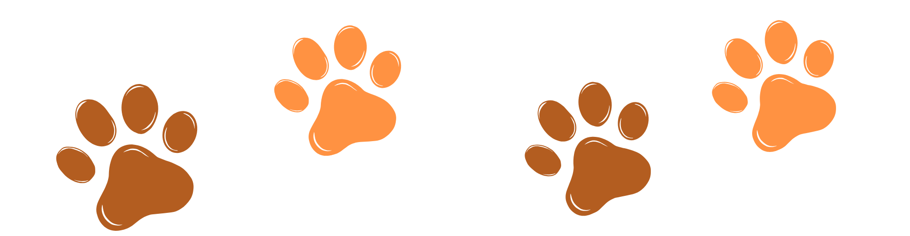

<!DOCTYPE html>
<html lang="pt-br">
<head>
    <meta charset="UTF-8">
    <meta name="viewport" content="width=device-width, initial-scale=1.0">
    <title>Abraço Animal | Proteção e Amor</title>
    
    <link href="https://fonts.googleapis.com/css2?family=Montserrat:wght@400;700&family=Open+Sans:wght@300;400;600&family=Poppins:wght@300;400;600;700&display=swap" rel="stylesheet">
    
    <link rel="stylesheet" href="https://cdnjs.cloudflare.com/ajax/libs/font-awesome/6.0.0/css/all.min.css">

    
</head>
<body>

    <header id="navbar">
        

            
        

        <button class="mobile-toggle" id="mobileToggle" aria-label="Abrir Menu">
            <i class="fas fa-bars"></i>
        </button>

        <nav id="navMenu">
            <ul>
                <li><a href="#inicio" onclick="closeNav()">Início</a></li>
                <li><a href="#adotar" onclick="closeNav()">Adoção</a></li>
                <li><a href="#rotina" onclick="closeNav()">Rotina</a></li>
                <li><a href="#contato" onclick="closeNav()">Contato</a></li>
            </ul>
        </nav>
    </header>

    <section id="inicio" class="hero">
        <h1 class="reveal">O amor não tem raça, tem abraço.</h1>
        
Resgatando vidas e criando novas histórias desde 2026.

        <button class="btn-cta reveal" onclick="location.href='#adotar'">Encontrar um amigo</button>
    </section>

    <section id="adotar" class="section-padding container">
        <h2 style="text-align: center; margin-bottom: 10px; font-size: 2rem;">Nossos Protegidos</h2>
        
Filtre por espécie e encontre sua alma gêmea.

        
        

            <button class="filter-btn active" onclick="filterPets('todos', event)">Todos</button>
            <button class="filter-btn" onclick="filterPets('cachorro', event)">Cachorros</button>
            <button class="filter-btn" onclick="filterPets('gato', event)">Gatos</button>
            <button class="filter-btn" onclick="filterPets('ouriço', event)">Ouriços</button>
            <button class="filter-btn" onclick="filterPets('papagaio', event)">Papagaios</button>
        

        

            

                Cachorro
                
                

                    <h3>Tico</h3>
                    
<i class="fas fa-venus-mars"></i> Macho | <i class="fas fa-dog"></i> Porte Pequeno

                    <button class="btn-cta" style="width:100%" onclick="openModal('Tico', 'Um cãozinho alegre e cheio de energia, resgatado na Zona Sul.')">Ver Dados</button>
                

            

            

                Gato
                
                

                    <h3>Aurora</h3>
                    
<i class="fas fa-venus-mars"></i> Fêmea | <i class="fas fa-cat"></i> Filhote

                    <button class="btn-cta" style="width:100%" onclick="openModal('Aurora', 'Dócil e ronronante, adora um colo e sachê de salmão.')">Ver Dados</button>
                

            

            

                Cachorro
                
                

                    <h3>Apollo</h3>
                    
<i class="fas fa-venus-mars"></i> Macho | <i class="fas fa-dog"></i> Porte Grande

                    <button class="btn-cta" style="width:100%" onclick="openModal('Apollo', 'Valente, forte e sempre em alerta, Apollo é ex-cão do Batalhão de Ações Especiais da Polícia, e hoje procura um novo lar para curtir sua aposentadoria.')">Ver Dados</button>
                

            

             

                Gato
                
                

                    <h3>Blaze</h3>
                    
<i class="fas fa-venus-mars"></i> Femea | <i class="fas fa-dog"></i> Porte Grande

                    <button class="btn-cta" style="width:100%" onclick="openModal('Apollo', 'Valente, forte e sempre em alerta, Apollo é ex-cão do Batalhão de Ações Especiais da Polícia, e hoje procura um novo lar para curtir sua aposentadoria.')">Ver Dados</button>
                

            

            

                Ouriço
                
                

                    <h3>Chuck</h3>
                    
<i class="fas fa-venus-mars"></i> Macho | <i class="fas fa-dog"></i> Porte pequeno

                    <button class="btn-cta" style="width:100%" onclick="openModal('Apollo', 'Valente, forte e sempre em alerta, Apollo é ex-cão do Batalhão de Ações Especiais da Polícia, e hoje procura um novo lar para curtir sua aposentadoria.')">Ver Dados</button>
                

            

            

                Papagaio
                
                

                    <h3>Jet</h3>
                    
<i class="fas fa-venus-mars"></i> Macho | <i class="fas fa-bird"></i> Porte pequeno

                    <button class="btn-cta" style="width:100%" onclick="openModal('Apollo', 'Valente, forte e sempre em alerta, Apollo é ex-cão do Batalhão de Ações Especiais da Polícia, e hoje procura um novo lar para curtir sua aposentadoria.')">Ver Dados</button>
                

            

             

                Cachorro
                
                

                    <h3>Chip</h3>
                    
<i class="fas fa-venus-mars"></i> Macho | <i class="fas fa-dog"></i> filhote

                    <button class="btn-cta" style="width:100%" onclick="openModal('Apollo', 'Valente, forte e sempre em alerta, Apollo é ex-cão do Batalhão de Ações Especiais da Polícia, e hoje procura um novo lar para curtir sua aposentadoria.')">Ver Dados</button>
                

            

            

                Cachorro
                
                

                    <h3>Shadow</h3>
                    
<i class="fas fa-venus-mars"></i> Macho | <i class="fas fa-dog"></i> filhote

                    <button class="btn-cta" style="width:100%" onclick="openModal('Apollo', 'Valente, forte e sempre em alerta, Apollo é ex-cão do Batalhão de Ações Especiais da Polícia, e hoje procura um novo lar para curtir sua aposentadoria.')">Ver Dados</button>
                

            

            

                Cachorro
                
                

                    <h3>Brutos</h3>
                    
<i class="fas fa-venus-mars"></i> Macho | <i class="fas fa-dog"></i> Porte Grande

                    <button class="btn-cta" style="width:100%" onclick="openModal('Apollo', 'Valente, forte e sempre em alerta, Apollo é ex-cão do Batalhão de Ações Especiais da Polícia, e hoje procura um novo lar para curtir sua aposentadoria.')">Ver Dados</button>
                

            

        

    </section>

    <section id="rotina" class="section-padding" style="background: #fdf2e9;">
        

            <h2 style="text-align: center; margin-bottom: 40px; font-size: 2rem;">Nossa Rotina de Excelência</h2>
            

                

                    
07:00 - 08:00

                    
Alimentação, Hidratação e Cuidados iniciais

                

                

                    
08:00 - 12:00

                    
Resgates, acolhimentos e atendimentos emergenciais

                

                

                    
12:00 - 13:00

                    
Intervalo da equipe

                

                

                    
13:00 - 15:00

                    
Consultas veterinárias e tratamento dos animais

                

                

                    
15:00 - 16:30

                    
Atendimento ao público e processos de adoção

                

                

                    
16:30 - 18:00

                    
Produção de conteúdo, campanhas e conscientização

                

            

        

    </section>

    <!-- Modal -->
    

        

            &times;
            <h2 id="modalTitle">Nome do Pet</h2>
            

            <button class="btn-cta">Iniciar Processo de Adoção</button>
        

    

    <footer id="contato">    
        

            

                <h3 style="color: var(--primary);">Abraço Animal</h3>
                
Um trabalho acadêmico por Lucas, Maria Beatriz, Mateus Abreu, Matheus Lima e Sarah.

            

            

                <h4>Contato</h4>
                
<i class="fas fa-envelope"></i> abracoanimal@gmail.com

                
<i class="fas fa-phone"></i> (11) 12345-6789

                
<i class="fas fa-map-marker-alt"></i> Av. Paulista, 345 - SP

            

            

                <h4>Social</h4>
                

                    <i class="fab fa-instagram"></i>
                    <i class="fab fa-facebook"></i>
                    <i class="fas fa-envelope"></i>
                    <i class="fab fa-tiktok"></i>
                

            

            
        

        

            CNPJ: 12.345.657/8910-11 | © Abraço Animal 2026 | Todos os direitos reservados
        

    </footer> 

    
</body>
</html>
